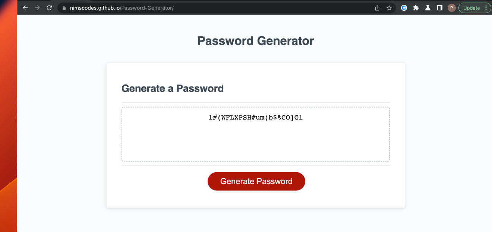

# Password Generator App

## Description

This application allows the user to generate a random secure password. The password can includes numeric, lower case, upper case and special characters depending on the user's choice. In this project HTML and CSS were used to build the structure and the layour of the application and Javascript was used to build its functionality.

 
## Usage

The following link gets you accesss to the application's website:

[password generator webpage](https://nimscodes.github.io/Password-Generator/)

The following image shows the web application's appearance and functionality:

## Credits

N/A

## License

N/A